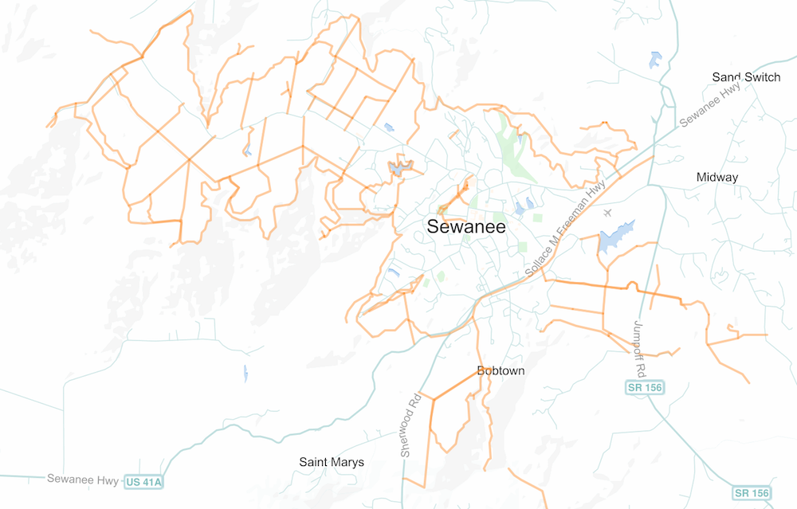

# Trail Data

This directory contains the trail geodata provided by the Landscape Analysis Lab.

* `shapefile.zip` - the original [shapefile archive](https://en.wikipedia.org/wiki/Shapefile) provided by the LAL
* [`trails.geojson`](trails.geojson) - trail data in [geojson format](https://en.wikipedia.org/wiki/GeoJSON)
* [`trails.min.geojson`](trails.geojson) - minified version of `trails.geojson`.
* `trails.kmz` - trail data in [kmz format](https://en.wikipedia.org/wiki/Keyhole_Markup_Language)

## Conversion process

I used [GDAL](https://en.wikipedia.org/wiki/GDAL)'s `ogr2ogr` utility to
convert the shapefile archive to geojson format using the following command:

    ogr2ogr -f GeoJSON -t_srs crs:84 trails.geojson shapefile/trails.shp

If you're interested, [here's a nice overview](http://ben.balter.com/2013/06/26/how-to-convert-shapefiles-to-geojson-for-use-on-github/) of why and how this was done.

Alternatively, you can use [this web service](http://ogre.adc4gis.com) to
convert from shapefile to geojson format, without having to install `gdal`. For
example, try ...

    curl -X POST -F targetSrs=CRS:84 -F upload=@shapefile.zip http://ogre.adc4gis.com/convert > trails.geojson
